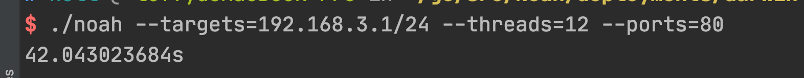

## 诺亚(Noah) 

一个基于golang的网页标题获取的工具

## 0x01 背景
之前在公司运维的时候，想要快速的获取web资产，网上已有的工具或多或少的存在一些问题，不满足现有的条件。所以基于golang写了web资产收集工具。
基于golang主要有两个原因:
1. golang天生的并发优势
2. 一次编译，到处运行的跨平台优势

## 0x02 编译
自行编译: 类Unix下面

```
CGO_ENABLED=0 GOOS=windows GOARCH=amd64 go build -a -ldflags "-s -w" -o noah.exe cmd/main.go
CGO_ENABLED=0 GOOS=darwin GOARCH=amd64 go build -a -ldflags "-s -w" -o noah cmd/main.go
CGO_ENABLED=0 GOOS=linux GOARCH=amd64 go build -a -ldflags "-s -w" -o noah cmd/main.go
```

也可以执行

```
make build
```
二进制文件放在deployment目录下

需要预先安装make工具。

当然最简单的还是直接使用已经编译好的二进制文件，支持linux,windows,macOS

如果想从源码运行，入口文件是cmd/main.go

## 0x03 使用

```
./noah --targets=192.168.1.1/24 --threads=12 --ports=80
```


结果放在同文件的results.json文件里

